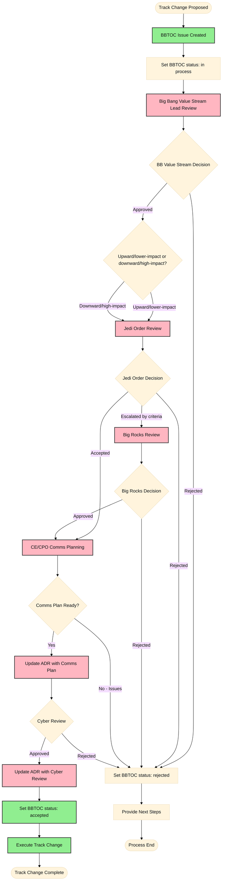

# Package Maintenance Tracks

## BBTOC Approval Process

A user must submit an issue to [the BBTOC](https://repo1.dso.mil/big-bang/product/bbtoc) for every track change request.

### Required BBTOC Issue Fields

- Current track and requested track.
- Change direction: `upward` or `downward`.
- Impact summary (users, support posture, release behavior).
- Proposed timeline.
- Release-notes question/notice content.
- Communication plan link (required for all requests before execution).
- Sponsor (required when a package enters or remains Big Bang Integrated).

### Externally Visible Status Model

Only these states are exposed externally in BBTOC:

- `in process`: request is under internal governance review.
- `accepted`: request passed required approvals and is cleared for execution.
- `rejected`: request was not approved and includes explicit next steps.

Status transitions:

- Set `in process` once the BBTOC issue is complete enough to enter review.
- Set `accepted` only after required governance approvals and Cyber checkpoint are complete.
- Set `rejected` immediately when any governance stage rejects the request.

### Governance Workflow

The BBTOC workflow uses a differential path: upward/lower-impact changes follow a lighter approval path, while downward/high-impact changes may require additional escalation.



Legend:

- Green (External): Steps visible/communicated to external stakeholders
- Pink (Internal): Internal governance steps (opaque to external stakeholders)

For packages that enter or remain in the Big Bang Integrated track, an explicit stakeholder sponsor must be identified and recorded as part of the BBTOC issue and ADR updates.

### Escalation Criteria (Jedi to Big Rocks)

Jedi escalates to Big Rocks when one or more of the following apply:

- Significant external stakeholder impact is expected.
- Support posture changes are broad or contentious.
- Cross-value-stream dependencies or roadmap impacts exist.
- Material disagreement cannot be resolved at Jedi level.

### Communication Plan Requirements

Before executing any accepted track change, CE/CPO communication planning must produce a linked artifact with, at minimum:

- Audience list.
- Communication channels.
- Message timeline and milestones.
- Communication owner(s).
- Release-notes language.

If communication planning fails or remains incomplete, the request is rejected until gaps are addressed.

### Cyber Review Checkpoint

Cyber review approval requires:

- Completion of required security review steps.
- Documented outcome linked in BBTOC issue and ADR amendment.
- Any required follow-up actions tracked to completion or accepted risk process.

### Rejection Handling

Any rejection must include a "Next Steps" section in the BBTOC issue that states:

- Why the request was rejected.
- What changes are required for re-submission.
- Earliest re-submission condition or date.

### Integrated Sponsor Policy

- Any request that enters or retains the Big Bang Integrated track must name an explicit stakeholder sponsor.
- If no sponsor is identified, the request cannot move to `accepted`.
- If a sponsor withdraws after acceptance, open a follow-on BBTOC issue to determine whether the package should move to Maintained.

## Track Change Notification

Big Bang should send track-change notices 90, 45, 30, 15, 7, 3, and 1 day before the move date. This does not apply to new adoptions. Notifications should be sent in:

- Big Bang Universe Slack [#announcements](https://bigbanguniver-ft39451.slack.com/archives/C050VKRU9HV) channel
- IL2 Platform One Mattermost Platform One Team [Value Stream - Big Bang](https://chat.il2.dso.mil/platform-one/channels/team---big-bang) channel
- Included in release notes for every release until the track change is complete

Each notification should include:

- The package name
- The date of the move
- The track the package is moving to
- The reason for the move
- The impact of the move
- The new CODEOWNERS (if applicable)
- A request for volunteers to become CODEOWNERS (if applicable)
- A link to the migration document (if applicable), including:
  - The new deployment strategy
  - The new support strategy
  - How to keep deployments up to date (for example, renovate)

Example Track Change Notices:

```md
---
## ⚠️ ∭ -> 🧹 TRACK CHANGE NOTICE ∭ -> 🧹 ⚠️

MyApp

Jan 01, 0001

On Jan 01, 0001 MyApp will be transitioning from the Big Bang Integrated Track to the Big Bang Maintained Track. Please note that this means while the Big Bang team will still provide updates to this package and test it deployed in isolation, they will not: test it with the rest of Big Bang (including on demand and nightly k8s distribution specific tests), test it in production-like environments, or include it as a direct option in the Big Bang chart. This will also limit the support the Big Bang team will be able to provide for this package to its deployment in isolation.

A migration document will be provided to help users move from the Big Bang Integrated Track to the Big Bang Maintained Track in the project repository.

---
```

```md
---
## ⚠️ 🧹 -> ֍ TRACK CHANGE NOTICE 🧹 -> ֍ ⚠️

MyApp

Jan 01, 0001

On Jan 01, 0001 MyApp will be transitioning from the Big Bang Maintained Track to the Community Maintained Track. Please note that this means this application will no longer get updates from the Big Bang Team. This will eliminate support the Big Bang team will be able to provide for this package. The new CODEOWNERS have been identified as @john.doe35 and @bob.smith12. If you would like to volunteer to be a CODEOWNER please reach out to the Big Bang team.

A migration document will be provided to help users move from the Big Bang Maintained Track to the Community Maintained Track in the project repository.
---
```

### Big Bang Integrated

This track includes packages that are owned and maintained by the Big Bang value stream, and are integrated to the Big Bang chart, i.e. all core and addon packages. Packages in this track require an explicit stakeholder sponsor.

- **+ Big Bang Integrated**: To add new packages to this track a user must follow the [BBTOC Approval Process](#bbtoc-approval-process). After approval, the work will include, but isn't limited to: defining the upstream (if applicable), selecting a mission team to own the package, identifying security needs, identifying and documenting an explicit stakeholder sponsor, and following the [Definition of Done Checklist](https://repo1.dso.mil/big-bang/team/team-charter/-/blob/main/docs/team_norms/new-gitLab-epic-checklist-template.md?ref_type=heads#definition-of-done-checklist).
- **-> Big Bang Maintained**: To move a package from BB Integrated to BB Maintained a user must follow the [BBTOC Approval Process](#bbtoc-approval-process). After approval, the [track change notifications](#track-change-notification) should begin as soon as possible. The work to move the package should not be released until the target date identified in the notification. That work will include, but is not limited to: updating the track badge, removing references in the Big Bang chart, updating the documentation to reflect its new deployment strategy.
- **-> Community Maintained**: This should typically be done by moving to Big Bang Maintained first. This gives customers who rely on the package more time to find alternatives. If it is known at the outset that a package will eventually move to Community Maintained, call that out in track change notifications.

### Big Bang Maintained

This track includes packages that are owned and updated by Big Bang, but will only be tested in isolation, e.g. package pipelines. The packages here will not be included in the Big Bang chart. The support that the community will receive will be limited to the package running in isolation, i.e. interactions with other package, networking issues, and emergent issues would not be supported.

- **-> Big Bang Integrated**: To move a package from BB Maintained to BB Integrated a user must follow the [BBTOC Approval Process](#bbtoc-approval-process). No notifications are required for this move. After approval, the work will include, but isn't limited to: identifying and documenting an explicit stakeholder sponsor, updating the track badge, adding references in the Big Bang chart, updating the documentation to reflect its new deployment strategy (likely as a Big Bang Addon).
- **+ Big Bang Maintained**: To add new packages to this track a user must follow the [BBTOC Approval Process](#bbtoc-approval-process). After approval, the work will include, but isn't limited to: defining the upstream (if applicable), selecting a mission team to own the package, identifying security needs, and following the [Definition of Done Checklist](https://repo1.dso.mil/big-bang/team/team-charter/-/blob/main/docs/team_norms/new-gitLab-epic-checklist-template.md?ref_type=heads#definition-of-done-checklist).
- **-> Community Maintained**: To move a package from BB Maintained to Community Maintained, a user must follow the [BBTOC Approval Process](#bbtoc-approval-process). After approval, [track change notifications](#track-change-notification) should begin as soon as possible. Finding new CODEOWNERS is preferred, but not required. If they have not been identified when a notification is sent, the notice should request volunteers to become CODEOWNERS. The work to move the package should not be released until the target date identified in the notification. That work includes, but is not limited to: updating the track badge, removing references in the Big Bang chart, moving the repo to the third-party group, and updating documentation to reflect its new deployment strategy.

### Community Maintained

This track includes packages that are owned and updated by the community. The Big Bang team will not provide updates or support for these packages.

- **-> Big Bang Maintained**: To move a package from Community Maintained to BB Maintained a user must follow the [BBTOC Approval Process](#bbtoc-approval-process). No notifications are required for this move. After approval, the work will include, but is not limited to: updating the track badge, adding references in the Big Bang chart, moving the repo to the Big Bang Universe group, updating the documentation to reflect its new deployment strategy (likely as a Big Bang Addon).
- **-> Big Bang Integrated**: To move a package from Community Maintained to BB Integrated a user must follow the [BBTOC Approval Process](#bbtoc-approval-process). No notifications are required for this move. After approval, the work will include, but isn't limited to: identifying and documenting an explicit stakeholder sponsor, updating the track badge, adding references in the Big Bang chart, moving the repo to the Big Bang Universe group, updating the documentation to reflect its new deployment strategy (likely as a Big Bang Addon).
- **+ Community Maintained**: To add new packages to this track a user must open an issue in the Big Bang repo and request the package be added to the Community Maintained track. The Big Bang team will create the repo and add a CODEOWNERS file with the user that requested the package as the CODEOWNER.
