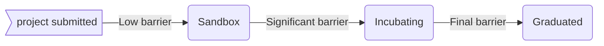

# Overview

The Technical Oversight Committee (TOC) serves as the conduit to support collaboration and evangelize community contributions to the Big Bang open source ecosystem.

- The Technical Oversight Committee ensures **Users** have access to high quality projects.
- The Technical Oversight Committee ensures **Contributors** have support to build a security focused project, and build an active user base to ensure longevity and ability to be used in production setting.

This policy describes the TOC project lifecycle, from sandbox to archival. It describes the requirements a project must meet in order to be classified and matured.

## Maturity Levels

Projects have three maturity level's: sandbox, incubating, or graduated. Archived is for projects no longer in active development. The maturity level is a classification on the health, value, and activity for a project.

### Sandbox

`Sandbox` projects are the entry point for early stage projects.

#### Sandbox Project Goals

1. Encourage visibility of early work that might add value to the community as a Big Bang package
2. Nurture projects on their path to adoption.
3. Facilitate alignment with existing projects, as appropriate.
4. Reduce the barrier to maturity by providing a community of support for engagement, governance, security, and policy recommendations

#### Sandbox Project Requirements

- Projects are proposed following the [process outlined here](https://repo1.dso.mil/platform-one/bbtoc/-/blob/master/projects/getting-started/README.md)
- Sandbox projects must meet the following criteria:  
  1. Code repository is in an unclassified, accessible repository (repo1 is desireable)
  2. Code repository must contain an Open source `LICENSE` file at the root of the repository
  3. Code repository must contain a `CONTRIBUTING.md` file at the root of the repository and provide sufficient information on how one can contribute
  4. Code repository must contain a `CODEOWNERS` file
  5. The project must have a clearly defined purpose
  6. The project must have a demonstrable prototype (intent is to prevent immature projects with minimal code in place)
- Consistent with Sandbox project goals the TOC looks for:

1.  Is the project a fit for Big Bang and the [DoD DevSecOps reference Design](https://dodcio.defense.gov/Portals/0/Documents/Library/DevSecOpsReferenceDesign.pdf)
2.  Does the project appear to be on a good path to becoming well-governed and vendor-neutral?

- Sandbox projects are tracked as [gitlab issues](https://repo1.dso.mil/platform-one/bbtoc/-/issues?scope=all&utf8=%E2%9C%93&state=opened&label_name[]=sandbox) with the `sandbox` label.

### Incubating

`Incubating` projects have adoption and show value added, but have not reached the maturity to commit to long term support to end users.

#### Incubating Project Goals

1. Further advance collaboration and validation of project objectives

#### Incubating Project Requirements

To mature to `Incubating` stage, a project must meet the `Sandbox` stage requirements plus:

- Active use by at least two customers and/or organizations
- Demonstrated support, through contributions and feature releases consistent with [Big Bang guidelines](https://repo1.dso.mil/platform-one/big-bang/bigbang)
- Have begun or completed an [Iron Bank](https://p1.dso.mil/#/products/iron-bank/) approval

Projects moving from sandbox to incubation are tracked as [gitlab issues](https://repo1.dso.mil/platform-one/bbtoc/-/issues?scope=all&utf8=%E2%9C%93&state=opened&label_name[]=graduated) with the `incubation` label.

### Graduated

`Graduated` projects are the highest level of maturity for a TOC project.

#### Graduated Project Goals

The chief goal of Graduated projects is to continue to expand and improve the package, its usage, and the number of customers contributing and consuming the package.

#### Graduated Project Requirements

- Meet requirements for `Incubating` status
- Active production use by multiple organizations/customers
- Base images approved in [Iron Bank](https://p1.dso.mil/#/products/iron-bank/)
- Full implementation of [Big Bang's Package Integration Guide](https://repo1.dso.mil/platform-one/big-bang/bigbang/-/blob/master/docs/developer/package-integration.md), including ...
  - Passing CICD Pipelines
  - Deployment with FluxCD Helm Releases
  - [Istio](https://istio.io/) service mesh integration
  - [Prometheus](https://prometheus.io/) metrics exporting and [Grafana](https://grafana.com/) dashboards
  - Database hooks (if database is used)
  - Object storage hooks (if object storage is used)
  - Single sign-on (either directly or using authservice)
  - Passing Helm tests
  - Network policies (ingress and egress) in place
  - Policy enforcement (e.g. Kyverno, Gatekeeper) in place
  - Required package documentation
- Teams should be able to deploy the package, for any documented use case without issue
- Security Stakeholders (Teams, Authorizing Officials, etc...) can obtain requisite documentation as part of the package to feed into an Authority to Operate (ATO)
  - Software Bill of Materials (SBOMs)
  - Security policies used (e.g. Kyverno, Gatekeeper), including exceptions/justifications
  - Network policies used
- Penetration Testing and Cyber Security Review

Projects moving from incubation to graduation are tracked as [gitlab issues](https://repo1.dso.mil/platform-one/bbtoc/-/issues?scope=all&utf8=%E2%9C%93&state=opened&label_name[]=graduated) with the `graduated` label.

## Archived

Archived projects are no longer in active development and are archived at a TOC meetup.

---

## Semi-annual Review Process

Projects are subject to an semi-annual review. This is intended to be a lightweight process to ensure that projects are active and effectively collaborated upon. The Projects Shepherd will engage the project on the review process.

The review should clearly address the following:

- Signs of active contributions and maturation.
- Project still meets the requirements of its maturity level.
- How can the TOC help you achieve your upcoming goals?
