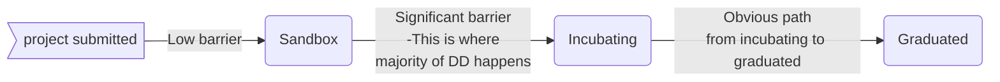

# I. Overview

**Disclaimer: This is a work in progress and has not yet been finalized. Your ideas and feedback are welcome, just submit an issue or join our next meetup.**

> ***note*** this process is intended to loosely mirror the CNCF Sandbox process. More details can be found [here](https://github.com/cncf/toc/blob/main/process/README.md)

This policy describes the Platform One Community Contributed project life cycle process, from sandbox to archival and more. It describes the stages a project may be admitted under and what the criteria and expectations are for a given stage, as well as the acceptance criteria for a project to move from one stage to another. It also describes the Annual Review Process through which those changes will be evaluated and made.

Project progression, movement from one stage to another, allows projects to participate at the level that is most appropriate for them given where they are in their lifecycle.

# II. Stages - Definitions & Expectations 

P1 Community Contributed projects have a maturity level of sandbox, incubating, or graduated. Archived is for projects no longer in active development. The maturity level is a signal by P1 Community Contributed as to what sorts of enterprises should be adopting different projects. Projects increase their maturity by demonstrating their sustainability to P1’s Technical Oversight Committee: that they have adoption, a healthy rate of changes, and committers from multiple organizations. 

## Sandbox: 

The `Sandbox` is the entry point for early stage projects and has four goals:

1. Promote an environment that encourages visibility of experiments to the TOC and Value Streams and early work that can add value to the Platform One mission and collaboration across the DevSecOps community
2. Facilitate alignment with existing projects if (and only if) this is desired.
3. Nurture projects (e.g., via Repo1 isssues).
4. Remove possible legal and governance obstacles to adoption and contribution by ensuring all projects adhere to Platform One legal, code of conduct, Cybersecurity and policy requirements.

## Incubating: 
`Incubating` projects have adoption and show value added to Platform One, but have not reach maturity to commit to long term support to end users.

## Graduated: 
`Graduated` projects signal the highest level of maturity for a Platform One Community Contributed project. 

Maturity Criteria:
* Can expect a minimum of 3 years of patch releases to address security issues
* Can expect a minimum of 2 years of support over chat
* Can expect a minimum of 1 year of stable releases to new funtionality

## Archived: 
Archived projects are no longer in active development and are only archived after a TOC vote.

# III. Project Proposal Process

Introduction:
This governance policy sets forth the proposal process for projects to be accepted into Platform One.
The process is the same for both existing projects which seek to move into Platform One, and new projects 
to be formed within Platform One.

## Sandbox Projects: 

Projects being submitted to the P1 TOC at the `Sandbox` level are intended to be the entry point for early stage projects and are not required to undergo due diligence. 

* Project are proposed following the [process outlined here](https://repo1.dso.mil/platform-one/p1toc/-/blob/master/projects/proposals/README.md)
* The P1TOC will review submissions for the following criteria:
	1. Is the project a fit for Platform One, in the TOC’s opinion? 
	2. Is the project’s roadmap in line with the goals of Platform One? 
	3. Does the project appear to be on a good path to becoming well-governed and vendor-neutral? 
* During this submission review, the TOC votes on each submission, and projects will be accepted by a simple majority vote of the TOC. 
* The TOC, or individual members may engage with project to ask further questions
* In the event of rejection, we will indicate which of these criteria the TOC did not believe were met. Projects are welcome to address feedback and submit again in the future.

Sandbox projects are tracked as [gitlab issues](https://repo1.dso.mil/platform-one/p1toc/-/issues?scope=all&utf8=%E2%9C%93&state=opened&label_name[]=graduated) with the `sandbox` label.

## Project Graduation Process: Sandbox to Incubating

Incubating projects are required to undergo due diligence as a part of the process to move from Sandbox to Incubation. Due Diligence is driven by a TOC sponsor, with two weeks for public comment before a vote is called. 

To be accepted to `Incubating` stage, a project must meet the `Sandbox` stage requirements plus:

Criteria: 
* Production use by at least two Platform One customers
* Project is publicly accessible on [repo1.dso.mil](https://repo1.dso.mil/)
* Active community participation
  - A minimum of one dedicated maintainer from a Platform One or Customer team
  - A substantial ongoing flow of commits and merged contributions from two or more active contributors
* Documentation to support widespread contribution and implementation
  - An up-to-date contributors guide
  - A minimum of one public reference implementation
  - Clearly documented processes explaining how and where to report security issues to the project

Projects moving from sandbox to incubation are tracked as [gitlab issues](https://repo1.dso.mil/platform-one/p1toc/-/issues?scope=all&utf8=%E2%9C%93&state=opened&label_name[]=graduated) with the `incubation` label.

## Project Graduation Process: Incubating to Graduated 

Graduated projects are required to undergo due diligence as a part of the process to move from Incubation to Graduated. Due Diligence is driven by a TOC sponsor, with two weeks for public comment before a vote is called. 

Criteria: 
* Meet criteria for `Sandbox` and `Incubating` status
* Production use by at least three Platform One customers with active teams larger than 50 individuals 
  who endorse transition to `Graduated Status`
* Active community participation
  - A minimum of two dedicated maintainers from a Platform One or Customer team
  - Dedicated mattermost channel on [chat.il2.dso.mil](https://chat.il2.dso.mil/) for development and support
* Documentation to support widespread contribution and implementation
  - A defined support process
  - A defined release process
* Receive a supermajority vote from the TOC to move to `Graduated` stage

Projects moving from incubation to graduation are tracked as [gitlab issues](https://repo1.dso.mil/platform-one/p1toc/-/issues?scope=all&utf8=%E2%9C%93&state=opened&label_name[]=graduated) with the `graduated` label.

## Archiving Projects

Open source projects have a lifecycle and there are times that projects become inactive due to a variety of reasons. There are also cases where a project may no longer want to be supported by the TOC, or the TOC may no longer wish to recommend the use of a project.

When voting on a proposal to archive a project, TOC members may wish to consider whether the project continues to meet the criteria for P1 TOC acceptance. The P1 TOC may also look at activity levels in the project, although it is important to note that there is a difference between a mature project that doesn't get much attention any more but is stable, versus a project that is inactive.

### Voting Process

To archive a project:
* A proposal must be put forth to the TOC repo
* The TOC will inform the project maintainers, P1 TOC end user community and wider community of all archiving proposals
* The proposal must remain open for at least 2 weeks of discussion after the maintainers are informed.
* A vote must be finalized with 2/3 approval from the P1 TOC

### Archiving Process

What does archiving for a Platform One Community Contribution project mean?
* P1 TOC will no longer provide support for the project via service desk
* P1 TOC will list archived projects online
* P1 TOC can provide services such as documentation updates to help transition users.
* Other P1 TOC marketing activities will no longer be provided for the project

# IV. Semi-annual Review Process 

Sandbox projects are subject to an semi-annual review by the TOC. This is intended to be a lightweight process to ensure that projects are on track, and getting the support they need.

Your annual review should answer the following questions:

* Include a link to your project’s devstats page. We will be looking for signs of consistent or increasing contribution activity. Please feel free to add commentary to add colour to the numbers and graphs we will see on devstats.
* How many maintainers do you have, and which organization are they from? (Feel free to link to an existing MAINTAINERS file if appropriate.)
* What do you know about adoption, and how has this changed since your last review / since you joined Sandbox? If you can list companies that are end users of your project, please do so. (Feel free to link to an existing ADOPTERS file if appropriate.)
* How has the project performed against its goals since the last review? (We won't penalize you if your goals changed for good reasons.)
* What are the current goals of the project? For example, are you working on major new features? Or are you concentrating on adoption or documentation?
* How can the P1 TOC help you achieve your upcoming goals?
* Do you think that your project meets the criteria for incubation?

Based on this review the P1 TOC will vote on whether to continue to sponsor the project in Sandbox. If the vote does not reach a simple majority, we will discuss archiving or other next steps with you.

Additionally, the P1 TOC might recommend that you apply for Incubation stage. This requires extra work and due diligence so it’s not a possible outcome to move directly to Incubation from this lightweight annual review.

It is fine for a project to stay in the Sandbox indefinitely while it is still active, but if a project has genuinely stalled we can save everyone’s effort by archiving it.

